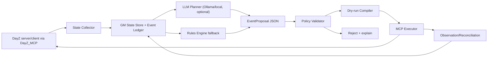

# Propuesta - AI Game Master para DayZ_MCP

Fecha: 2026-06-30
Autor: Codex
Estado: propuesta de plan, sin implementacion
Proyecto: DayZ_MCP / DayZ_MCP_dev

## Resumen ejecutivo

Mi voto: construir el Game Master como un **sidecar Python del DayZ_MCP**, no como logica autonoma dentro de Enforce ni como un LLM llamando tools crudas. La IA debe proponer eventos en JSON estructurado; un motor determinista local valida, limita, ejecuta y audita cada accion usando la tool surface del MCP o nuevos verbos tipados.

Primer objetivo jugable:

1. Observar estado del servidor: jugadores, posiciones, zonas, eventos activos, clima, hora, riesgo.
2. Elegir un evento de una libreria acotada: horda, loot drop, pista/mensaje, clima dramatico, emboscada o mini-mision.
3. Validar seguridad: distancia a players, safe zones, bases/traders, cooldowns, caps por zona, caps globales.
4. Ejecutar por MCP: spawnear entidades, mandar mensajes, opcionalmente cambiar clima/hora, registrar todo.
5. Confirmar con evidencia estructurada: entidades existen, evento queda registrado, cleanup posterior funciona.

No intentaria en v1 que el modelo "administre el servidor" libremente. Lo haria como **director creativo bajo barandillas duras**.

## Estado verificado de partida

- El proyecto ya define DayZ_MCP como tools tipadas, server-authoritative, sin teclas SO ni OCR: `DayZ_MCP_dev/CLAUDE.md:7-14`, `DayZ_MCP_dev/product-spec.md:11-16`.
- El transporte actual es HTTP local sobre `127.0.0.1`, con el mod haciendo `GET`/`POST` async hacia Python: `DayZ_MCP_dev/CLAUDE.md:28-34`.
- La regla dura del bridge es no usar `RestContext.*_now` en tick; solo callbacks async: `DayZ_MCP_dev/CLAUDE.md:36-38`.
- La seguridad existente es fail-closed: bind local, API key, whitelist de comandos: `DayZ_MCP_dev/CLAUDE.md:39-43`.
- El MCP ya tiene broker con modos `--client`, `--daemon` y `--embedded`, y el daemon es el unico dueno de `:8765`: `DayZ_MCP_dev/CLAUDE.md:74-90`.
- La tool surface Python ya serializa llamadas con `runtime.tool_lock`: `DayZ_MCP_dev/tools/dayz_mcp/server.py:52-57`, `DayZ_MCP_dev/tools/dayz_mcp/server.py:491-508`, `DayZ_MCP_dev/tools/dayz_mcp/server.py:737-791`.
- El loopback ya separa comandos server/client y whitelistea comandos conocidos: `DayZ_MCP_dev/tools/dayz_mcp/loopback.py:19-42`, `DayZ_MCP_dev/tools/dayz_mcp/loopback.py:91-129`.
- El bridge server actual despacha `query_player_state`, `world_spawn`, `scene_raycast`, `telemetry_read`, `world_time_set`, `world_weather_set` y otros comandos: `DayZ_MCP/scripts/5_Mission/MCPBridge.c:324-398`.
- `world_spawn` usa `GetGame().CreateObjectEx(...)` y espera un job de readiness: `DayZ_MCP/scripts/5_Mission/MCPBridge.c:400-430`.
- Clima y tiempo ya tienen verbos server-side con read-after-write: `DayZ_MCP/scripts/5_Mission/MCPBridge.c:772-855`.
- El peer cliente ya maneja camara y vehiculos owner-side, con comandos `vehicle_get_in_client`, `engine_set`, `vehicle_control`, `vehicle_telemetry`, `vehicle_release`: `DayZ_MCP/scripts/5_Mission/MCPClientBridge.c:430-485`, `DayZ_MCP/scripts/5_Mission/MCPClientBridge.c:592-777`.
- Para mensajes a jugadores, vanilla `PlayerBase` expone `Message`, `MessageStatus`, `MessageAction`, `MessageFriendly`, `MessageImportant`: `scripts/4_world/entities/manbase/playerbase.c:6590-6623`.
- Para dar items a un jugador, existe `PlayerBase.CreateInInventory(string item_name, string cargo_type = "", bool full_quantity = false)`: `scripts/4_world/entities/manbase/playerbase.c:6525-6539`.
- Para item quantity, `ItemBase.SetQuantity(...)` esta en vanilla: `scripts/4_world/entities/itembase.c:3340`.
- Hay prior art externo de Expansion AI spawning en el workspace, pero no debe tratarse como API cerrada del MCP: `_recovered/HM_Core_Module/Scripts/ENFUSION_AI_PROJECT/ExpansionAISpawner.c:1-5`, `_recovered/HM_Core_Module/Scripts/ENFUSION_AI_PROJECT/ExpansionAISpawner.c:71-80`, `_recovered/HM_Core_Module/Scripts/ENFUSION_AI_PROJECT/ExpansionAISpawner.c:104-153`.
- Expansion Quests no esta disponible como source completo aqui; solo encontre un modded bridge de LBmaster que toca markers de `ExpansionQuestModule`, no APIs de asignacion de quest: `LBmaster_Groups/scripts/4_World/LBmaster_Groups/OtherMods/ExpansionQuestModule.c:1-35`.

Fuentes externas actuales:

- Ollama documenta tool calling y bucles de agente: https://docs.ollama.com/capabilities/tool-calling
- Ollama documenta structured outputs con JSON schema: https://docs.ollama.com/capabilities/structured-outputs
- Ollama documenta compatibilidad parcial con OpenAI API, incluyendo `/v1/chat/completions`, JSON mode y tools: https://docs.ollama.com/api/openai-compatibility
- `qwen3:4b` en Ollama tiene 4.02B parametros, Q4_K_M y 2.5 GB: https://ollama.com/library/qwen3:4b
- `gemma3:4b` en Ollama tiene vision, 4.3B parametros, Q4_K_M y 3.3 GB: https://ollama.com/library/gemma3:4b

## Suposiciones fijadas para esta propuesta

Como pediste no preguntar, fijo estas decisiones por defecto:

- El primer target es `DayZ_MCP_dev`, no un mod separado desde cero.
- El servidor productivo tiene Ryzen 9800X3D sin GPU; el modelo debe ser local CPU-friendly.
- Preferencia economica: coste cero por defecto. Cloud/API externa queda como opcion manual, no dependencia.
- El GM no debe tocar persistencia binaria del juego en v1.
- La IA no recibe credenciales ni secretos. Si hay keys para APIs externas, se pasan por env var y se documentan como opt-in.
- Expansion Quests queda como fase opcional despues de un spike de API real; no se promete en el MVP.
- El plan prioriza evidencia estructurada sobre "el script acabo bien".

## Decision de arquitectura

### Alternativas consideradas

**A. LLM directo con acceso a todas las tools MCP**

Ventaja: rapido de prototipar.

Problema: demasiado peligroso. Un modelo pequeno en CPU puede alucinar argumentos, repetir acciones, spawnear demasiado, o saltarse cooldowns. Tambien mezcla razonamiento creativo con autorizacion de acciones.

Veredicto: no recomendado.

**B. Game Master determinista + LLM como proponente**

Ventaja: la IA aporta variedad y narrativa, pero no ejecuta nada sin pasar por validadores deterministicos. Es compatible con la disciplina actual del MCP: tools tipadas, whitelist, fail-closed, evidencias.

Veredicto: recomendado.

**C. Game Master sin LLM, solo reglas**

Ventaja: muy estable, cero coste y cero latencia.

Problema: menos variedad. Aun asi debe existir como fallback cuando el modelo local no este disponible.

Veredicto: usarlo como modo degradado y como baseline de tests.

## Diseno recomendado

[DESIGN]


### Componentes

1. `GMService`

Proceso Python opcional que vive cerca del MCP, idealmente bajo `DayZ_MCP_dev/tools/dayz_mcp/gm/`. Corre cada N segundos, observa estado y decide si propone evento. No reemplaza al daemon MCP; lo usa.

2. `StateCollector`

Recoge datos por herramientas existentes y nuevos snapshots:

- `bridge_status` para liveness.
- `query_player_state` como base single-player actual.
- Nuevo `gm_player_snapshot` para multi-player.
- `telemetry_read` / `scene_raycast` para evidencias puntuales.
- Ledger propio de eventos activos.

3. `LLMPlanner`

Adaptador de proveedor con interfaz estable:

[DESIGN]
```json
{
  "provider": "ollama",
  "model": "qwen3:4b",
  "mode": "structured_json",
  "timeout_s": 20,
  "max_output_tokens": 1200
}
```

El prompt pide un `EventProposal` y nada mas. El modelo no llama directamente `world_spawn`, `exec_enforce` ni comandos bridge.

4. `PolicyValidator`

Validador determinista. Es la pieza mas importante. Rechaza o modifica propuestas segun:

- allowlist de tipos de evento;
- allowlist de clases DayZ spawnables;
- max entidades por evento;
- max entidades vivas globales;
- cooldown por player, zona y tipo;
- distancia minima a jugadores;
- distancia maxima para que el evento sea relevante;
- prohibicion de safe zones/traders/bases;
- caps de loot value;
- caps de dificultad segun numero de jugadores online;
- horario/clima permitidos;
- no repetir evento similar cerca del mismo player.

5. `EventCompiler`

Convierte una propuesta validada a acciones MCP atomicas. Ejemplo:

[DESIGN]
```json
{
  "event_id": "gm_20260630_001",
  "actions": [
    {"verb": "gm_message_players", "audience": "nearby", "text": "Se oye actividad al norte."},
    {"verb": "gm_spawn_infected", "count": 8, "center": [6321.0, 0.0, 7812.0], "radius": 35.0},
    {"verb": "gm_spawn_loot_drop", "tier": "low", "center": [6300.0, 0.0, 7790.0]},
    {"verb": "world_weather_set", "overcast": 0.65, "rain": 0.0, "fog": 0.08}
  ]
}
```

6. `MCPExecutor`

Ejecuta acciones serializadas, observa resultados y guarda evidencia. No permite acciones que no vengan compiladas por `EventCompiler`.

7. `EventLedger`

Archivo JSONL append-only:

[DESIGN]
```json
{
  "ts": "2026-06-30T02:30:00Z",
  "event_id": "gm_20260630_001",
  "proposal_source": "ollama:qwen3:4b",
  "accepted": true,
  "reason": "player_looting_low_risk_zone",
  "actions": 4,
  "spawned": [{"net_id": "123:456", "type": "ZmbM_PatrolNormal_Autumn"}],
  "cleanup_deadline_s": 900,
  "result": "active"
}
```

## Modelo local recomendado

### Default v1

Usar **Ollama local** por simplicidad operativa:

- OpenAI-compatible endpoint local si queremos reusar cliente `openai` (`base_url=http://localhost:11434/v1/`).
- Tool calling existe, pero para este proyecto prefiero **structured outputs** con JSON schema y validacion Pydantic. Es mas facil de auditar y evita que el modelo se crea autorizado a ejecutar tools.
- Modelo inicial: `qwen3:4b`.
- Fallback rapido: un modelo mas pequeno de la familia Qwen si el benchmark local da demasiada latencia.
- Vision opcional: `gemma3:4b` solo si queremos resumir screenshots para narrativa o auditoria visual. No lo pondria en el loop principal del GM.

### Por que no un modelo grande

Sin GPU, modelos de 12B+ pueden funcionar pero no son buena base para un loop de servidor. Para el GM no necesitamos maxima inteligencia; necesitamos variedad razonable, obediencia a schema y latencia predecible. La creatividad se puede conseguir con una libreria de plantillas + un LLM pequeno, no con un modelo enorme.

### Benchmark obligatorio antes de elegir modelo definitivo

Fase 0 debe medir en el 9800X3D real:

- tiempo p50/p95 para producir un `EventProposal`;
- ratio de JSON valido;
- ratio de propuestas rechazadas por policy;
- consumo RAM;
- impacto CPU mientras el server DayZ esta activo.

Exit criteria recomendado:

- p95 <= 12 s para decisiones normales;
- JSON valido >= 99% con reintento unico;
- cero acciones ejecutadas si el modelo no responde, responde tarde o rompe schema;
- uso CPU del GM acotado por scheduler, nunca en tick de DayZ.

## Contrato de datos: EventProposal

La IA solo puede devolver esto.

[DESIGN]
```json
{
  "schema_version": 1,
  "intent": "increase_pressure|reward_exploration|direct_story|cool_down|no_op",
  "event_type": "infected_horde|loot_drop|weather_shift|radio_clue|ambush|expansion_quest_offer|no_op",
  "target": {
    "mode": "player|zone|global",
    "player_id": "optional",
    "center": [0.0, 0.0, 0.0],
    "radius_m": 100.0
  },
  "difficulty": 1,
  "duration_s": 600,
  "narrative": {
    "public_message": "",
    "private_hint": ""
  },
  "requested_actions": [
    {
      "type": "spawn_infected",
      "count": 6,
      "tier": "low"
    }
  ],
  "safety_notes": [
    "why this is fair"
  ]
}
```

Regla: si falta cualquier campo requerido, si `event_type` no esta en enum, o si `difficulty`/`count` exceden policy, se rechaza.

## Verbos MCP nuevos propuestos

Estos verbos son una propuesta, no firmas finales. Cada uno requiere cite-then-verify contra source antes de implementar.

### Fase minima de bridge

1. `gm_player_snapshot`

Devuelve lista de players autoritativos:

- identity/plain id si disponible;
- posicion;
- salud/estado basico;
- en vehiculo si aplica;
- zona calculada por Python o Enforce.

Razon: `query_player_state` actual sirve para POC/single-player, pero un GM de servidor necesita todos los jugadores.

2. `gm_message_players`

Manda mensaje a todos, a un player, o a players cerca de una zona. Fuente base a verificar/usar: `PlayerBase.Message*` existe en vanilla (`scripts/4_world/entities/manbase/playerbase.c:6590-6623`).

3. `gm_spawn_infected`

Spawnea infectados o AI de una allowlist. Debe devolver entidades realmente creadas, con tipo, posicion y network id. No usar clases arbitrarias del modelo.

4. `gm_spawn_loot_drop`

Crea un contenedor/objeto de loot con items de una tabla server-side. Para player inventory directo, vanilla tiene `PlayerBase.CreateInInventory(...)` (`scripts/4_world/entities/manbase/playerbase.c:6525-6539`), pero v1 deberia preferir loot en mundo/contenedor para evitar manipulacion silenciosa del inventario del jugador.

5. `gm_cleanup_event`

Limpia entidades marcadas por `event_id`. Debe ser idempotente. Si no encuentra nada, devuelve `ok=true` con `deleted=0`, no error.

6. `gm_event_snapshot`

Devuelve cuantos entes vivos quedan de un evento, posiciones aproximadas y deadline de cleanup.

### Fase opcional

7. `gm_expansion_quest_offer`

Integra Expansion Quests, solo despues de verificar source/API real del mod instalado. Hasta entonces, simular "misiones" con mensajes + objetivos propios + ledger.

## Politicas de seguridad y fairness

El LLM no decide estas reglas. Son config.

[DESIGN]
```yaml
gm:
  enabled: false
  dry_run: true
  provider: ollama
  model: qwen3:4b
  tick_interval_s: 90
  max_events_active: 3
  max_spawned_entities_global: 60
  max_spawned_entities_per_event: 15
  min_distance_to_player_m: 80
  max_distance_to_target_m: 450
  player_cooldown_s: 1800
  zone_cooldown_s: 1200
  event_cleanup_s: 900
  safe_zone_policy: deny
  base_radius_policy: deny
  allow_inventory_grants: false
  allow_weather: true
  allow_expansion_quests: false
```

Hard rules:

- Fail-closed si no hay snapshot de jugadores.
- Fail-closed si no se puede resolver zona segura/trader/base y la accion esta cerca de players.
- Fail-closed si el LLM devuelve accion no reconocida.
- Fail-closed si el bridge peer no esta vivo o version_state bloquea.
- No `exec_enforce` para GM.
- No clases arbitrarias desde prompt.
- No spawn masivo sin cleanup deadline.
- No tocar persistencia en v1.

## Ideas de eventos para el Game Master

### MVP

1. **Horda de presion ligera**

Si un jugador lleva mucho tiempo looteando una ciudad, crear 4-8 infectados a distancia segura, con mensaje ambiental. No spawnear encima del jugador.

2. **Loot drop contextual**

Si un grupo sobrevive a un evento o esta bajo equipado, spawnear caja pequena con loot bajo/medio. Debe tener cooldown fuerte para no romper economia.

3. **Pista por radio/chat**

Mensaje narrativo con coordenadas aproximadas o referencia de lugar. No requiere quest system.

4. **Cambio de clima narrativo**

Niebla/overcast suave antes de un evento. Ya hay `world_weather_set`.

5. **Evento no-op inteligente**

La IA puede decidir no actuar si el servidor ya esta tenso, hay pocos jugadores o hay eventos activos.

### Segunda ola

6. **Emboscada en carretera**

Spawn de enemigos/obstaculos lejos del player, con loot pequeno y cleanup.

7. **Cadena de pistas**

Tres mensajes/zonas en secuencia: pista -> encuentro -> recompensa.

8. **Rescate o extraccion**

Spawn de contenedor/objeto objetivo y enemigos alrededor. El completion lo detecta con proximidad/telemetria.

9. **Caceria de jefe**

Un infectado/AI especial con nombre narrativo y loot controlado. Requiere clase verificada.

10. **Director de ritmo**

Si hay demasiadas muertes o mucha presion, el GM solo genera ayudas pequenas o clima despejado. Si hay aburrimiento, sube presion.

11. **Eventos por zonas calientes**

Aprende zonas con mucha actividad reciente y reparte eventos para evitar que todo ocurra en el mismo pueblo.

12. **Misiones Expansion**

Cuando se verifique API/config: asignar/ofrecer quest existente, no generar quest nueva al vuelo en v1.

13. **Rumores falsos controlados**

Pequena probabilidad de pista incompleta o rumor, nunca con recompensa imposible. Mantiene misterio sin romper confianza.

14. **Admin digest**

Resumen cada X minutos: eventos lanzados, rechazos por policy, carga de entidades, players afectados.

15. **Modo temporada**

Arcos narrativos semanales: infeccion, contrabando, tormentas, patrullas. La IA elige variaciones dentro de un tema.

## Fases de implementacion

### Fase H0 - Research y DPF

Objetivo: convertir esta propuesta en alcance aceptable y no huerfano de product-spec.

Tareas:

- Crear grupo H en `product-spec.md`: "AI Game Master".
- Definir criterios H1-Hn con intenciones y gates.
- Verificar APIs DayZ para:
  - spawn de infectados vanilla;
  - borrado de entidades/event cleanup;
  - mensajes server->player;
  - creacion de loot en mundo/contenedor;
  - snapshots multi-player;
  - posibilidad real de Expansion Quests.
- Medir Ollama local en CPU con `qwen3:4b` y fallback.

Gate:

- Research codex/claude consolidado.
- Product-spec actualizado.
- No hay API nombrada sin `path:line` o label `[ASSUMPTION]`.

### Fase H1 - GM offline simulator

Objetivo: probar inteligencia y policy sin tocar DayZ.

Implementar:

- `EventProposal` Pydantic schema.
- `GMPolicy`.
- `EventLedger`.
- `RulesEngine` fallback.
- `OllamaPlanner`.
- fixtures de snapshots: servidor vacio, 1 player, 5 players, safe zone, evento activo, overload.

Validacion:

- Unit tests para JSON valido/invalido.
- Tests de rejection: spawn cerca de player, safe zone, count alto, loot excesivo.
- Golden fixtures: para cada snapshot, el GM produce no-op o evento permitido.
- Benchmark local: latencia y ratio JSON valido.

Exit:

- Cero llamadas a DayZ.
- Cero side effects.
- `dry_run` produce plan legible y ledger de decisiones.

### Fase H2 - Bridge minimo seguro

Objetivo: exponer verbos GM que faltan, con caps server-side.

Implementar:

- `gm_player_snapshot`
- `gm_message_players`
- `gm_spawn_infected` con allowlist hardcoded/config
- `gm_spawn_loot_drop` con tabla hardcoded/config
- `gm_cleanup_event`
- `gm_event_snapshot`

Cambios esperados:

- `loopback.py`: ampliar `SERVER_COMMANDS`.
- `server.py`: tools/wrappers o runtime interno para esos comandos.
- `MCPMessages.c`: DTOs nuevos o campos flat suficientes.
- `MCPBridge.c`: dispatch y handlers server-side.
- Tests Python para whitelist/bad_peer/queue.
- Gate in-game con un evento minimo.

Validacion:

- Offline: py_compile + tests existentes.
- Enforce sweep/compile.
- In-game: spawn 3 infectados, snapshot los ve, cleanup los borra, repetir cleanup no falla.
- In-game: mensaje llega a player.
- In-game: loot drop crea solo allowlist.

Exit:

- Nada depende del LLM todavia.
- Los verbos son seguros por si solos.

### Fase H3 - Primer GM jugable dry-run -> live

Objetivo: un GM que pueda correr en vivo con eventos pequenos.

Implementar:

- Scheduler cada 90 s.
- `dry_run=true` por defecto.
- Admin command/CLI para `gm once --dry-run`, `gm once --live`, `gm disable`, `gm cleanup-all`.
- Integracion con DayZ_MCP daemon existente.
- Eventos MVP: horda ligera, loot drop bajo, pista/mensaje, clima.

Validacion:

- Dry-run en servidor real durante 30 min: 0 acciones, ledger correcto.
- Live con admin presente: 1 evento horda + cleanup.
- Live con LLM apagado: fallback rules engine funciona.
- Live con DayZ_MCP peer caido: no action, error limpio.

Exit:

- Puede quedarse encendido en `dry_run`.
- Para live, requiere `gm.enabled=true` y caps bajos.

### Fase H4 - Expansion Quests adapter

Objetivo: usar Expansion Quests sin confabular API.

Precondicion:

- Source o docs exactas del mod instalado.
- Quest IDs existentes.
- Entender si la asignacion es server-side, config-driven, NPC-driven o RPC/client.

Implementar solo si se verifica:

- `gm_expansion_quest_offer(player, quest_id)` o alternativa real.
- Mapeo de templates GM -> quest IDs existentes.
- Gate que confirma quest visible/asignada.

Fallback si no hay API limpia:

- Misiones propias del GM: mensajes + objetivos por proximidad + ledger + recompensas controladas.

### Fase H5 - Produccion local

Objetivo: dejarlo operable sin estar mirando.

Implementar:

- Servicio Windows o task runner opcional.
- Config versionada.
- Rotacion de logs.
- Admin dashboard simple o CLI.
- Panic switch.
- `gm report` con resumen.
- Reglas por mapa/servidor.
- Modo "quiet hours".

Validacion:

- 4 h en dry-run.
- 1 h live con caps bajos.
- No crece entidad viva sin limite.
- No hay spam de chat/log.
- Reinicio del GM conserva ledger y limpia eventos huerfanos si corresponde.

## Gates anti false-pass

Un evento no pasa solo porque el comando devuelva `ok`.

Cada evento debe tener:

1. `proposal_id`
2. `validated=true`
3. `actions_compiled`
4. `actions_executed`
5. `observation_after`
6. `cleanup_deadline`
7. `final_state=completed|expired|cleaned|failed`

Ejemplo de criterios:

- Horda: `spawned_count >= requested_min`, entidades a distancia valida, cleanup borra o marca expiradas.
- Loot: contenedor existe, items pertenecen a allowlist, no excede value budget.
- Mensaje: command ok + player target existia.
- Quest: visible/asignada segun API real, no solo llamada ejecutada.

## Riesgos principales

1. **Modelo local lento o tonto**

Mitigacion: no llama cada tick; schema estricto; fallback de reglas; benchmark H0.

2. **Spawn de infectados no se comporta como esperamos**

Mitigacion: H0 verifica API y H2 gate in-game. No declarar "horda lista" con solo `CreateObjectEx` si la IA no activa/aggro/navmesh no funciona.

3. **Expansion Quests no tiene API server-side limpia**

Mitigacion: tratarlo como opcional; primero misiones propias del GM.

4. **Economia rota por loot**

Mitigacion: loot tables fijas, value budget, cooldown fuerte, dry-run y audit.

5. **Players sienten injusticia**

Mitigacion: no spawn encima; mensajes anticipatorios; caps por jugador; no chain-events al mismo player.

6. **Entidad huerfana**

Mitigacion: event registry, network ids, cleanup idempotente, cleanup-all, TTL.

7. **Superficie de seguridad se abre demasiado**

Mitigacion: no `exec_enforce`; no raw command from LLM; nuevos verbos tipados; allowlists.

## Plan para Claude

Claude deberia tomar esta propuesta y hacer:

1. Grill de producto H0 cuando el usuario este disponible: confirmar si el GM va al `product-spec.md` como grupo H.
2. Research dual sobre APIs exactas:
   - infectados vanilla;
   - limpieza de entidades;
   - mensajes;
   - loot/container;
   - Expansion Quests.
3. Convertir H0-H3 en plan de fase con criterios H1-Hn.
4. Mantener Expansion Quests fuera del MVP hasta tener API real.
5. Pedir a Codex implementacion solo cuando el plan tenga:
   - archivos exactos;
   - firmas verificadas;
   - fixtures positivos/negativos;
   - gates offline e in-game.

## Plan para Codex cuando llegue implementacion

1. Revisar criticamente el plan de Claude antes de editar.
2. Re-verificar cada API con `path:line`.
3. Implementar primero simulator y policy offline.
4. No meter refactors adyacentes.
5. Para Enforce, completar client/server data map por verbo.
6. Tests antes de live.
7. In-game gate con evidencia estructurada.

## Recomendacion final

Construirlo por capas:

1. **GM offline simulator** con Ollama local y policy dura.
2. **Bridge minimo** para snapshots, mensajes, horda, loot y cleanup.
3. **Primer evento live** muy pequeno.
4. **Expansion Quests** solo despues del spike.

Esto da un Game Master IA util sin convertir el server en un experimento inseguro. El valor real no esta en que la IA tenga "mucho poder"; esta en que el server tenga un director que propone variedad, y un runtime que solo ejecuta lo que puede demostrar y limpiar.
